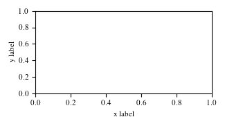

# mpl_sizes

A lightweight tool for setting `figsize` and font sizes in `matplotlib`, with support for:

- ICLR
- ICML
- NeurIPS
- Informatics thesis 

## Installation
```bash
git clone git@github.com:BayesWatch/mpl_sizes.git
cd mpl_sizes 
python setup.py install
```

## Usage

In your plotting script: 

```python
import matplotlib.pyplot as plt
from mpl_sizes import get_format

formatter = get_format("InfThesis") # options: ICLR, ICML, NeurIPS, InfThesis

fig, ax = plt.subplots(figsize=formatter.text_width_plot())
```

Formatters have two methods: 
- `text_width_plot` - for full pagewidth plots (e.g. in double column, this would be a full width plot)
- `line_width_plot` - for plots the width of the lines of text

and font size will automatically be set correctly. 

A full example is given in `example.py`. 

You can also set aspect ratio to be: "narrow", "normal", "wide", or "equal". 

## Aspect ratios

You can also set aspect ratio to be: "narrow", "normal", "wide", or "equal".   


e.g. 

A single column width plot for ICML:



A double column width plot in wide aspect ratio:
